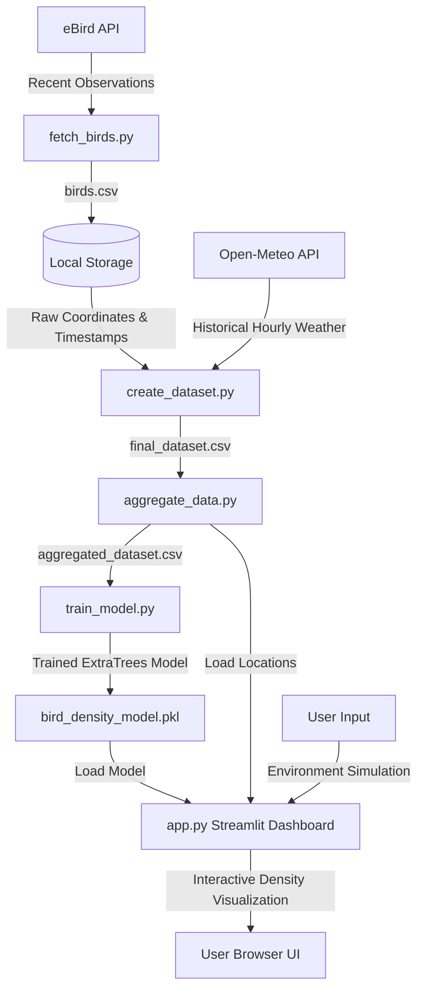

# AeroBird: Bird Density Prediction System

AeroBird is an end-to-end machine learning and data visualization platform designed to predict and map bird density (abundance) across different regions in India using real-time citizen-science data, environment observations, and geospatial coordinates.

---

## Architecture & Component Interactions



---

## Technology Stack

- **Data Sources:** 
  - **eBird API:** Fetches recent bird observation data (species, abundance, coordinates, date).
  - **Open-Meteo API:** Retrieves exact historical hourly weather conditions (temperature, humidity, wind speed) matching the timestamps and coordinates of the observations.
- **Machine Learning Layer:**
  - **Scikit-Learn:** Employs an optimized `ExtraTreesRegressor` model chosen via GridSearchCV.
  - **Feature Engineering:** Includes cyclical encoding for hour of day using sine/cosine transformations to capture diurnal bird movement patterns.
- **Interactive Dashboard:**
  - **Streamlit:** Serves the frontend web dashboard.
  - **PyDeck:** Visualizes spatial distribution and bird abundance on interactive 3D map projections.
- **Environment Security:**
  - **Dotenv:** Manages credentials secure storage.

---

## Project Structure

```
birddensity_prediction/
│
├── app/
│   └── app.py                  # Streamlit Web App & PyDeck Visualizations
│
├── data/
│   └── birds.csv               # Raw bird observations downloaded from eBird
│
├── models/
│   └── bird_density_model.pkl  # Trained ExtraTreesRegressor model
│
├── scripts/
│   ├── fetch_birds.py          # Queries eBird API and saves birds.csv
│   ├── create_dataset.py       # Queries weather data and aligns with observations
│   ├── aggregate_data.py       # Aggregates sightings by location and hour
│   └── train_model.py          # Performs model training and evaluation
│
├── .env                        # Local environment credentials (Git-ignored)
├── .gitignore                  # Specified files to prevent committing
└── README.md                   # Project documentation
```

---

## Machine Learning & Features

The regressor is trained on the following feature set to predict `total_birds` (the count of birds seen in a checklist session):

1. **Latitude (`lat`):** Geographic location coordinate.
2. **Longitude (`lng`):** Geographic location coordinate.
3. **Temperature (`temperature`):** Aligned ambient hourly temperature in °C.
4. **Humidity (`humidity`):** Aligned relative humidity percentage.
5. **Wind Speed (`wind_speed`):** Aligned wind speed in km/h.
6. **Hour (`hour`):** 24-hour timestamp of the checklist.
7. **Hour Sin (`hour_sin`):** Sine of the hour to represent cyclical time patterns.
8. **Hour Cos (`hour_cos`):** Cosine of the hour to represent cyclical time patterns.

---

## Setup and Installation

### 1. Clone the Repository & Configure Environment
Create a `.env` file in the root directory and add your eBird API Token:
```env
EBIRD_API_KEY=your_ebird_api_key_here
```

### 2. Install Dependencies
```bash
pip install pandas numpy scikit-learn requests pydeck streamlit python-dotenv
```

### 3. Run the Data Pipeline & Training (Optional)
If you want to fetch new eBird records, retrieve aligned hourly weather metrics, and rebuild the model:
```bash
python scripts/fetch_birds.py
python scripts/create_dataset.py
python scripts/aggregate_data.py
python scripts/train_model.py
```

### 4. Run the Streamlit Application
```bash
streamlit run app/app.py
```
